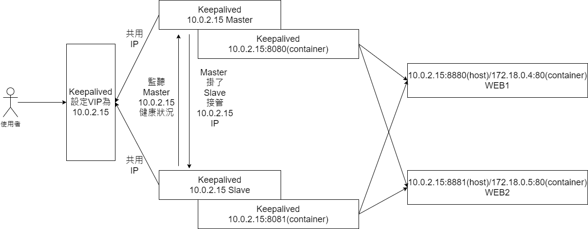

# docker-nginx-backup-server-and-loadblance

# 版本
Host主機作業系統: Ubuntu 20.04.3 LTS<br>
Docker: Docker version 19.03.8<br>
Container作業系統: Ubuntu 18.04.3 LTS<br>

# 情景
架設一台主server和一個備用server，當主server斷線或其他原因掛掉，備用server將會接手主server的一切，並且支援load blancer的功能

# 使用的工具和設備的資料
利用Nginx+keepalived實作一台主server，一個備用server和load blancer<br><br>
假設Host主機IP為140.0.0.1<br>
Host Server IP: 140.0.0.1<br>
虛擬IP: 172.18.0.15（希望改用實體IP）<br>
主Server IP: 140.0.0.1:8880 對應container 172.18.0.2:80<br>
備用Server IP: 140.0.0.1:8881 對應container 172.18.0.3:80<br>
Web1 Server IP: 140.0.0.1:8882 對應container 172.18.0.4:80<br>
Web2 Server IP: 140.0.0.1:8883 對應container 172.18.0.5:80<br>

**問題**：目前遇到的問題是想要在keepalived的虛擬IP改用為140.0.0.1實體，這樣可以讓使用者連進來，目前不知道實體IP是否能取代虛擬IP？
<br><br>

## 創建VIP的keepalived架構圖

<br><br>

## 使用VM實體IP當作keepalived的虛擬IP



# Image和網絡環境建立
## 創建 base image
```
cd base
docker build -t nginx_base .
cd ..
```

## 創建 master image
```
cd master
docker build -t nginx_master .
cd ..
```

## 創建 Slave image
```
cd slave
docker build -t nginx_slave .
cd ..
```

## 創建 Web image
```
cd web
docker build -t nginx_web .
cd ..
```

## 建立一個172.18.0.0/24子網絡
```
docker network create --subnet=172.18.0.0/24 test-network
docker network ls
NETWORK ID          NAME                DRIVER              SCOPE
8aa82cadb992        bridge              bridge              local
1c6dc9a181fd        host                host                local
6e57738d4cf8        none                null                local
1f3b89f652fe        test-network        bridge              local
```

## 執行Master container
```
docker run -d \
    --name nginx_master \
    --net=host \
    --privileged \
    nginx_master
```

## 執行Slave container
```
docker run -d \
    --name nginx_slave \
    --net=host \
    --privileged \
    nginx_slave
```

## 執行Web1 and Web2 container
```
docker run -d \
    -p 8880:80 -p 8024:22 \
    --privileged \
    --name web1 \
    --net test-network \
    -e "name=WEB1" \
    nginx_web

docker run -d \
    -p 8881:80 -p 8025:22 \
    --privileged \
    --name web2 \
    --net test-network \
    -e "name=WEB2" \
    nginx_web
```

# Container內部設定
## Master設定
```
docker exec -it nginx_master bash # 開啟container

ifconfig
br-de252fe03c4f: flags=4163<UP,BROADCAST,RUNNING,MULTICAST>  mtu 1500
        inet 172.18.0.1  netmask 255.255.0.0  broadcast 172.18.255.255
        inet6 fe80::42:5dff:feea:19bf  prefixlen 64  scopeid 0x20<link>
        ether 02:42:5d:ea:19:bf  txqueuelen 0  (Ethernet)
        RX packets 268305  bytes 11208796 (11.2 MB)
        RX errors 0  dropped 0  overruns 0  frame 0
        TX packets 15330  bytes 3046677 (3.0 MB)
        TX errors 0  dropped 0 overruns 0  carrier 0  collisions 0

docker0: flags=4163<UP,BROADCAST,RUNNING,MULTICAST>  mtu 1500
        inet 172.17.0.1  netmask 255.255.0.0  broadcast 172.17.255.255
        inet6 fe80::42:d0ff:fe5f:ed60  prefixlen 64  scopeid 0x20<link>
        ether 02:42:d0:5f:ed:60  txqueuelen 0  (Ethernet)
        RX packets 127699  bytes 5293464 (5.2 MB)
        RX errors 0  dropped 0  overruns 0  frame 0
        TX packets 138486  bytes 393051757 (393.0 MB)
        TX errors 0  dropped 0 overruns 0  carrier 0  collisions 0

enp0s3: flags=4163<UP,BROADCAST,RUNNING,MULTICAST>  mtu 1500
        inet 10.0.2.15  netmask 255.255.255.0  broadcast 10.0.2.255
        inet6 fe80::c39c:1121:5a29:b436  prefixlen 64  scopeid 0x20<link>
        ether 08:00:27:0f:bf:98  txqueuelen 1000  (Ethernet)
        RX packets 718212  bytes 743751455 (743.7 MB)
        RX errors 0  dropped 0  overruns 0  frame 0
        TX packets 251358  bytes 25512091 (25.5 MB)
        TX errors 0  dropped 0 overruns 0  carrier 0  collisions 0

lo: flags=73<UP,LOOPBACK,RUNNING>  mtu 65536
        inet 127.0.0.1  netmask 255.0.0.0
        inet6 ::1  prefixlen 128  scopeid 0x10<host>
        loop  txqueuelen 1000  (Local Loopback)
        RX packets 89382  bytes 6884365 (6.8 MB)
        RX errors 0  dropped 0  overruns 0  frame 0
        TX packets 89382  bytes 6884365 (6.8 MB)
        TX errors 0  dropped 0 overruns 0  carrier 0  collisions 0

veth3313b8a: flags=4163<UP,BROADCAST,RUNNING,MULTICAST>  mtu 1500
        inet6 fe80::48d5:a5ff:fe34:f74e  prefixlen 64  scopeid 0x20<link>
        ether 4a:d5:a5:34:f7:4e  txqueuelen 0  (Ethernet)
        RX packets 2267  bytes 301862 (301.8 KB)
        RX errors 0  dropped 0  overruns 0  frame 0
        TX packets 2908  bytes 514234 (514.2 KB)
        TX errors 0  dropped 0 overruns 0  carrier 0  collisions 0

veth3e81bef: flags=4163<UP,BROADCAST,RUNNING,MULTICAST>  mtu 1500
        inet6 fe80::143c:81ff:fe5b:4f04  prefixlen 64  scopeid 0x20<link>
        ether 16:3c:81:5b:4f:04  txqueuelen 0  (Ethernet)
        RX packets 2531  bytes 359902 (359.9 KB)
        RX errors 0  dropped 0  overruns 0  frame 0
        TX packets 3256  bytes 578186 (578.1 KB)
        TX errors 0  dropped 0 overruns 0  carrier 0  collisions 0

veth429f090: flags=4163<UP,BROADCAST,RUNNING,MULTICAST>  mtu 1500
        inet6 fe80::6814:c8ff:fef5:31d4  prefixlen 64  scopeid 0x20<link>
        ether 6a:14:c8:f5:31:d4  txqueuelen 0  (Ethernet)
        RX packets 781  bytes 73671 (73.6 KB)
        RX errors 0  dropped 0  overruns 0  frame 0
        TX packets 11030  bytes 7842662 (7.8 MB)
        TX errors 0  dropped 0 overruns 0  carrier 0  collisions 0
```

### 顯示目前的IP
```
ip appr
1: lo: <LOOPBACK,UP,LOWER_UP> mtu 65536 qdisc noqueue state UNKNOWN group default qlen 1000
    link/loopback 00:00:00:00:00:00 brd 00:00:00:00:00:00
    inet 127.0.0.1/8 scope host lo
       valid_lft forever preferred_lft forever
    inet6 ::1/128 scope host 
       valid_lft forever preferred_lft forever
2: enp0s3: <BROADCAST,MULTICAST,UP,LOWER_UP> mtu 1500 qdisc fq_codel state UP group default qlen 1000
    link/ether 08:00:27:0f:bf:98 brd ff:ff:ff:ff:ff:ff
    inet 10.0.2.15/24 brd 10.0.2.255 scope global dynamic noprefixroute enp0s3
       valid_lft 53737sec preferred_lft 53737sec
    inet 10.0.2.15/32 scope global enp0s3
       valid_lft forever preferred_lft forever
    inet6 fe80::c39c:1121:5a29:b436/64 scope link noprefixroute 
       valid_lft forever preferred_lft forever
4: docker0: <BROADCAST,MULTICAST,UP,LOWER_UP> mtu 1500 qdisc noqueue state UP group default 
    link/ether 02:42:d0:5f:ed:60 brd ff:ff:ff:ff:ff:ff
    inet 172.17.0.1/16 brd 172.17.255.255 scope global docker0
       valid_lft forever preferred_lft forever
    inet6 fe80::42:d0ff:fe5f:ed60/64 scope link 
       valid_lft forever preferred_lft forever
12: veth429f090@if11: <BROADCAST,MULTICAST,UP,LOWER_UP> mtu 1500 qdisc noqueue master docker0 state UP group default 
    link/ether 6a:14:c8:f5:31:d4 brd ff:ff:ff:ff:ff:ff link-netnsid 2
    inet6 fe80::6814:c8ff:fef5:31d4/64 scope link 
       valid_lft forever preferred_lft forever
57: br-de252fe03c4f: <BROADCAST,MULTICAST,UP,LOWER_UP> mtu 1500 qdisc noqueue state UP group default 
    link/ether 02:42:5d:ea:19:bf brd ff:ff:ff:ff:ff:ff
    inet 172.18.0.1/16 brd 172.18.255.255 scope global br-de252fe03c4f
       valid_lft forever preferred_lft forever
    inet6 fe80::42:5dff:feea:19bf/64 scope link 
       valid_lft forever preferred_lft forever
235: veth3313b8a@if234: <BROADCAST,MULTICAST,UP,LOWER_UP> mtu 1500 qdisc noqueue master br-de252fe03c4f state UP group default 
    link/ether 4a:d5:a5:34:f7:4e brd ff:ff:ff:ff:ff:ff link-netnsid 0
    inet6 fe80::48d5:a5ff:fe34:f74e/64 scope link 
       valid_lft forever preferred_lft forever
237: veth3e81bef@if236: <BROADCAST,MULTICAST,UP,LOWER_UP> mtu 1500 qdisc noqueue master br-de252fe03c4f state UP group default 
    link/ether 16:3c:81:5b:4f:04 brd ff:ff:ff:ff:ff:ff link-netnsid 1
    inet6 fe80::143c:81ff:fe5b:4f04/64 scope link 
       valid_lft forever preferred_lft forever
```

### Nginx upstream的設定
```
cat /etc/nginx/sites-enabled/default
upstream test {
    server 172.18.0.2 weight=6;
    server 172.18.0.3 weight=4;
}

server {
    listen 8080 default_server;
    listen [::]:8080 default_server;
    
    location / {
        add_header Cache-Control "no-store";
        proxy_pass http://test;
    }
}
```

### keepalived的設定
```
cat /etc/keepalived/keepalived.conf
global_defs {
    router_id nginx_master
}

vrrp_script chk_http_port {
    script "/opt/bin/nginx_check.sh"
    interval 2
    weight -20
}
vrrp_instance VI_1 {
    state MASTER
    interface eth0
    virtual_router_id 55
    priority 100
    advert_int 1
    authentication {
        auth_type PASS
        auth_pass 1111
    }
    track_script {
        chk_http_port
    }
    virtual_ipaddress {
        10.0.2.15        #VIP 想要換成 實體IP
    }
}
```

### 重新啟動Nginx，若啟動失敗則2秒後殺掉keepalived
```
cat /opt/bin/nginx_check.sh
#!/bin/bash
A=`ps -C nginx --no-header |wc -l`
if [ $A -eq 0 ];then
    /etc/init.d/nginx                # start nginx
    sleep 2
    if [ `ps -C nginx --no-header |wc -l` -eq 0 ];then
        killall keepalived
    fi
fi
```

## Slave設定
```
docker exec -it nginx_slave bash # 開啟container

ifconfig
br-de252fe03c4f: flags=4163<UP,BROADCAST,RUNNING,MULTICAST>  mtu 1500
        inet 172.18.0.1  netmask 255.255.0.0  broadcast 172.18.255.255
        inet6 fe80::42:5dff:feea:19bf  prefixlen 64  scopeid 0x20<link>
        ether 02:42:5d:ea:19:bf  txqueuelen 0  (Ethernet)
        RX packets 268305  bytes 11208796 (11.2 MB)
        RX errors 0  dropped 0  overruns 0  frame 0
        TX packets 15325  bytes 3045734 (3.0 MB)
        TX errors 0  dropped 0 overruns 0  carrier 0  collisions 0

docker0: flags=4163<UP,BROADCAST,RUNNING,MULTICAST>  mtu 1500
        inet 172.17.0.1  netmask 255.255.0.0  broadcast 172.17.255.255
        inet6 fe80::42:d0ff:fe5f:ed60  prefixlen 64  scopeid 0x20<link>
        ether 02:42:d0:5f:ed:60  txqueuelen 0  (Ethernet)
        RX packets 127699  bytes 5293464 (5.2 MB)
        RX errors 0  dropped 0  overruns 0  frame 0
        TX packets 138482  bytes 393050901 (393.0 MB)
        TX errors 0  dropped 0 overruns 0  carrier 0  collisions 0

enp0s3: flags=4163<UP,BROADCAST,RUNNING,MULTICAST>  mtu 1500
        inet 10.0.2.15  netmask 255.255.255.0  broadcast 10.0.2.255
        inet6 fe80::c39c:1121:5a29:b436  prefixlen 64  scopeid 0x20<link>
        ether 08:00:27:0f:bf:98  txqueuelen 1000  (Ethernet)
        RX packets 718187  bytes 743744498 (743.7 MB)
        RX errors 0  dropped 0  overruns 0  frame 0
        TX packets 251216  bytes 25502175 (25.5 MB)
        TX errors 0  dropped 0 overruns 0  carrier 0  collisions 0

lo: flags=73<UP,LOOPBACK,RUNNING>  mtu 65536
        inet 127.0.0.1  netmask 255.0.0.0
        inet6 ::1  prefixlen 128  scopeid 0x10<host>
        loop  txqueuelen 1000  (Local Loopback)
        RX packets 88930  bytes 6857201 (6.8 MB)
        RX errors 0  dropped 0  overruns 0  frame 0
        TX packets 88930  bytes 6857201 (6.8 MB)
        TX errors 0  dropped 0 overruns 0  carrier 0  collisions 0

veth3313b8a: flags=4163<UP,BROADCAST,RUNNING,MULTICAST>  mtu 1500
        inet6 fe80::48d5:a5ff:fe34:f74e  prefixlen 64  scopeid 0x20<link>
        ether 4a:d5:a5:34:f7:4e  txqueuelen 0  (Ethernet)
        RX packets 2267  bytes 301862 (301.8 KB)
        RX errors 0  dropped 0  overruns 0  frame 0
        TX packets 2903  bytes 513291 (513.2 KB)
        TX errors 0  dropped 0 overruns 0  carrier 0  collisions 0

veth3e81bef: flags=4163<UP,BROADCAST,RUNNING,MULTICAST>  mtu 1500
        inet6 fe80::143c:81ff:fe5b:4f04  prefixlen 64  scopeid 0x20<link>
        ether 16:3c:81:5b:4f:04  txqueuelen 0  (Ethernet)
        RX packets 2531  bytes 359902 (359.9 KB)
        RX errors 0  dropped 0  overruns 0  frame 0
        TX packets 3251  bytes 577243 (577.2 KB)
        TX errors 0  dropped 0 overruns 0  carrier 0  collisions 0

veth429f090: flags=4163<UP,BROADCAST,RUNNING,MULTICAST>  mtu 1500
        inet6 fe80::6814:c8ff:fef5:31d4  prefixlen 64  scopeid 0x20<link>
        ether 6a:14:c8:f5:31:d4  txqueuelen 0  (Ethernet)
        RX packets 781  bytes 73671 (73.6 KB)
        RX errors 0  dropped 0  overruns 0  frame 0
        TX packets 11026  bytes 7841806 (7.8 MB)
        TX errors 0  dropped 0 overruns 0  carrier 0  collisions 0
```

### 顯示目前的IP
```
ip addr
1: lo: <LOOPBACK,UP,LOWER_UP> mtu 65536 qdisc noqueue state UNKNOWN group default qlen 1000
    link/loopback 00:00:00:00:00:00 brd 00:00:00:00:00:00
    inet 127.0.0.1/8 scope host lo
       valid_lft forever preferred_lft forever
    inet6 ::1/128 scope host 
       valid_lft forever preferred_lft forever
2: enp0s3: <BROADCAST,MULTICAST,UP,LOWER_UP> mtu 1500 qdisc fq_codel state UP group default qlen 1000
    link/ether 08:00:27:0f:bf:98 brd ff:ff:ff:ff:ff:ff
    inet 10.0.2.15/24 brd 10.0.2.255 scope global dynamic noprefixroute enp0s3
       valid_lft 53900sec preferred_lft 53900sec
    inet 10.0.2.15/32 scope global enp0s3
       valid_lft forever preferred_lft forever
    inet6 fe80::c39c:1121:5a29:b436/64 scope link noprefixroute 
       valid_lft forever preferred_lft forever
4: docker0: <BROADCAST,MULTICAST,UP,LOWER_UP> mtu 1500 qdisc noqueue state UP group default 
    link/ether 02:42:d0:5f:ed:60 brd ff:ff:ff:ff:ff:ff
    inet 172.17.0.1/16 brd 172.17.255.255 scope global docker0
       valid_lft forever preferred_lft forever
    inet6 fe80::42:d0ff:fe5f:ed60/64 scope link 
       valid_lft forever preferred_lft forever
12: veth429f090@if11: <BROADCAST,MULTICAST,UP,LOWER_UP> mtu 1500 qdisc noqueue master docker0 state UP group default 
    link/ether 6a:14:c8:f5:31:d4 brd ff:ff:ff:ff:ff:ff link-netnsid 2
    inet6 fe80::6814:c8ff:fef5:31d4/64 scope link 
       valid_lft forever preferred_lft forever
57: br-de252fe03c4f: <BROADCAST,MULTICAST,UP,LOWER_UP> mtu 1500 qdisc noqueue state UP group default 
    link/ether 02:42:5d:ea:19:bf brd ff:ff:ff:ff:ff:ff
    inet 172.18.0.1/16 brd 172.18.255.255 scope global br-de252fe03c4f
       valid_lft forever preferred_lft forever
    inet6 fe80::42:5dff:feea:19bf/64 scope link 
       valid_lft forever preferred_lft forever
235: veth3313b8a@if234: <BROADCAST,MULTICAST,UP,LOWER_UP> mtu 1500 qdisc noqueue master br-de252fe03c4f state UP group default 
    link/ether 4a:d5:a5:34:f7:4e brd ff:ff:ff:ff:ff:ff link-netnsid 0
    inet6 fe80::48d5:a5ff:fe34:f74e/64 scope link 
       valid_lft forever preferred_lft forever
237: veth3e81bef@if236: <BROADCAST,MULTICAST,UP,LOWER_UP> mtu 1500 qdisc noqueue master br-de252fe03c4f state UP group default 
    link/ether 16:3c:81:5b:4f:04 brd ff:ff:ff:ff:ff:ff link-netnsid 1
    inet6 fe80::143c:81ff:fe5b:4f04/64 scope link 
       valid_lft forever preferred_lft forever
```

### 設定nginx upstream
```
cat /etc/nginx/sites-enabled/default
upstream test {
    server 172.18.0.2 weight=6;
    server 172.18.0.3 weight=4;
}

server {
    listen 8080 default_server;
    listen [::]:8080 default_server;
    
    location / {
        add_header Cache-Control "no-store";
        proxy_pass http://test;
    }
}
```

### 設定keepalived
```
cat /etc/keepalived/keepalived.conf
global_defs {
    router_id nginx_slave
}

vrrp_script chk_http_port {
    script "/opt/bin/nginx_check.sh"
    interval 2
    weight -20
}

vrrp_instance VI_1 {
    state MASTER
    interface eth0
    virtual_router_id 55
    priority 90
    advert_int 1
    authentication {
        auth_type PASS
        auth_pass 1111
    }
    track_script {
        chk_http_port
    }
    virtual_ipaddress {
        10.0.2.15        #VIP 想要換成 實體IP
    }
}
```

### 重新啟動Nginx，若啟動失敗則2秒後殺掉keepalived
```
cat /opt/bin/nginx_check.sh
#!/bin/bash
A=`ps -C nginx --no-header |wc -l`
if [ $A -eq 0 ];then
    /etc/init.d/nginx                # start nginx
    sleep 2
    if [ `ps -C nginx --no-header |wc -l` -eq 0 ];then
        killall keepalived
    fi
fi
```