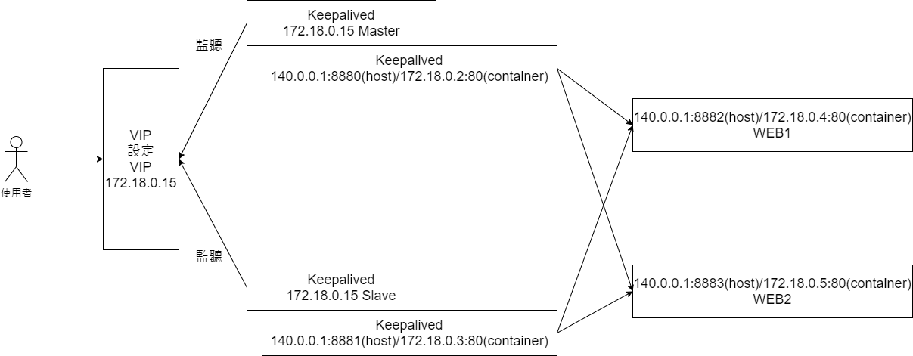
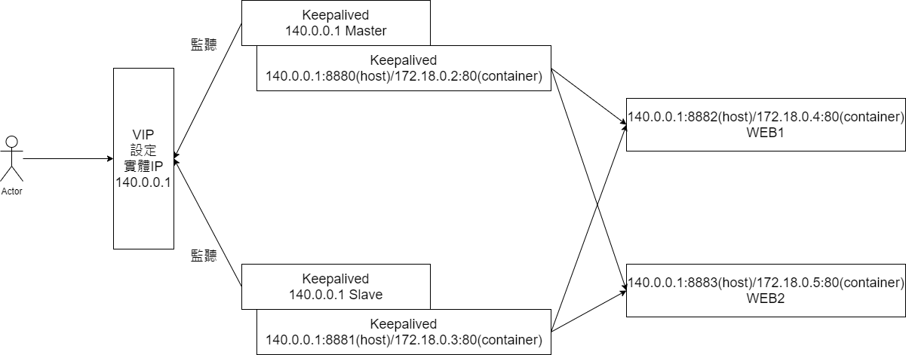

# docker-nginx-backup-server-and-loadblance

# 版本
Host主機作業系統: Ubuntu 20.04 LTS<br>
Docker: Docker version 19.03.8<br>
Container作業系統: Ubuntu 18.04.3 LTS<br>

# 情景
架設一台主server和一個備用server，當主server斷線或其他原因掛掉，備用server將會接手主server的一切，並且支援load blancer的功能

# 使用的工具和設備的資料
利用Nginx+keepalived實作一台主server，一個備用server和load blancer<br><br>
假設Host主機IP為140.0.0.1<br>
Host Server IP: 140.0.0.1<br>
虛擬IP: 172.18.0.15（希望改用實體IP）<br>
主Server IP: 140.0.0.1:8880 對應container 172.18.0.2:80<br>
備用Server IP: 140.0.0.1:8881 對應container 172.18.0.3:80<br>
Web1 Server IP: 140.0.0.1:8882 對應container 172.18.0.4:80<br>
Web2 Server IP: 140.0.0.1:8883 對應container 172.18.0.5:80<br>

<!-- 假設VM (Virtual box) 主機IP為10.0.2.15<br>
VM Server IP: 10.0.2.15<br>
虛擬IP(VIP) : 10.0.2.15（虛擬IP 用VM IP）<br>

主Server IP: 10.0.2.15:8080 對應container 172.18.0.2:80<br>
備用Server IP: 10.0.2.15:8081 對應container 172.18.0.3:80<br>
Web1 Server IP: 10.0.2.15:8880 對應container 172.18.0.4:80<br>
Web2 Server IP: 10.0.2.15:8881 對應container 172.18.0.5:80<br> -->

**問題**：目前遇到的問題是想要在keepalived的虛擬IP改用為140.0.0.1實體，這樣可以讓使用者連進來，目前不知道實體IP是否能取代虛擬IP？
<br><br>

## 創建VIP的keepalived架構圖

<br><br>

## 創建實體IP的keepalived架構圖（希望成為這樣的架構）
<!--  -->


# Image和網絡環境建立
## 創建 base image
```
cd base
docker build -t nginx_base .
cd ..
```

## 創建 master image
```
cd master
docker build -t nginx_master .
cd ..
```

## 創建 Slave image
```
cd slave
docker build -t nginx_slave .
cd ..
```

## 創建 Web image
```
cd web
docker build -t nginx_web .
cd ..
```

## 建立一個172.18.0.0/24子網絡
```
docker network create --subnet=172.18.0.0/24 test-network
docker network ls
NETWORK ID          NAME                DRIVER              SCOPE
8aa82cadb992        bridge              bridge              local
1c6dc9a181fd        host                host                local
6e57738d4cf8        none                null                local
1f3b89f652fe        test-network        bridge              local
```

## 執行Master container
```
docker run -d \
    -p 8880:80 -p 8022:22 \
    --name nginx_master \
    --privileged \
    --net test-network \
    nginx_master
```

## 執行Slave container
```
docker run -d \
    -p 8881:80 -p 8023:22 \
    --name nginx_slave \
    --privileged \
    --net test-network \
    nginx_slave
```

## 執行Web1 and Web2 container
```
docker run -d \
    -p 8882:80 -p 8024:22 \
    --privileged \
    --name web1 \
    --net test-network \
    -e "name=WEB1" \
    nginx_web

docker run -d \
    -p 8883:80 -p 8025:22 \
    --privileged \
    --name web2 \
    --net test-network \
    -e "name=WEB2" \
    nginx_web
```

# Container內部設定
## Master設定
```
docker exec -it nginx_master bash # 開啟container

ifconfig
eth0: flags=4163<UP,BROADCAST,RUNNING,MULTICAST>  mtu 1500
        inet 172.18.0.2  netmask 255.255.255.0  broadcast 172.18.0.255
        ether 02:42:ac:12:00:02  txqueuelen 0  (Ethernet)
        RX packets 23  bytes 3347 (3.3 KB)
        RX errors 0  dropped 0  overruns 0  frame 0
        TX packets 30  bytes 1500 (1.5 KB)
        TX errors 0  dropped 0 overruns 0  carrier 0  collisions 0

lo: flags=73<UP,LOOPBACK,RUNNING>  mtu 65536
        inet 127.0.0.1  netmask 255.0.0.0
        loop  txqueuelen 1000  (Local Loopback)
        RX packets 0  bytes 0 (0.0 B)
        RX errors 0  dropped 0  overruns 0  frame 0
        TX packets 0  bytes 0 (0.0 B)
        TX errors 0  dropped 0 overruns 0  carrier 0  collisions 0
```

### 顯示目前的IP
```
ip appr
1: lo: <LOOPBACK,UP,LOWER_UP> mtu 65536 qdisc noqueue state UNKNOWN group default qlen 1000
    link/loopback 00:00:00:00:00:00 brd 00:00:00:00:00:00
    inet 127.0.0.1/8 scope host lo
       valid_lft forever preferred_lft forever
319: eth0@if320: <BROADCAST,MULTICAST,UP,LOWER_UP> mtu 1500 qdisc noqueue state UP group default
    link/ether 02:42:ac:12:00:02 brd ff:ff:ff:ff:ff:ff link-netnsid 0
    inet 172.18.0.2/24 brd 172.18.0.255 scope global eth0
       valid_lft forever preferred_lft forever
    inet 172.18.0.15/32 scope global eth0
       valid_lft forever preferred_lft forever
```

### Nginx upstream的設定
```
cat /etc/nginx/sites-enabled/default
upstream test {
    server 172.18.0.4 weight=6;
    server 172.18.0.5 weight=4;
}

server {
    listen 80;
    server_name 172.18.0.2;  #container ip
    location / {
        proxy_pass http://test;
    }
}
```

### keepalived的設定
```
cat /etc/keepalived/keepalived.conf
global_defs {
    router_id nginx_master
}

vrrp_script chk_http_port {
    script "/opt/bin/nginx_check.sh"
    interval 2
    weight -20
}
vrrp_instance VI_1 {
    state MASTER
    interface eth0
    virtual_router_id 55
    priority 100
    advert_int 1
    authentication {
        auth_type PASS
        auth_pass 1111
    }
    track_script {
        chk_http_port
    }
    virtual_ipaddress {
        172.18.0.15        #VIP 想要換成 實體IP
    }
}
```

### 重新啟動Nginx，若啟動失敗則2秒後殺掉keepalived
```
cat /opt/bin/nginx_check.sh
#!/bin/bash
A=`ps -C nginx --no-header |wc -l`
if [ $A -eq 0 ];then
    /etc/init.d/nginx                # start nginx
    sleep 2
    if [ `ps -C nginx --no-header |wc -l` -eq 0 ];then
        killall keepalived
    fi
fi
```

## Slave設定
```
docker exec -it nginx_slave bash # 開啟container

ifconfig
eth0: flags=4163<UP,BROADCAST,RUNNING,MULTICAST>  mtu 1500
        inet 172.18.0.3  netmask 255.255.255.0  broadcast 172.18.0.255
        ether 02:42:ac:12:00:03  txqueuelen 0  (Ethernet)
        RX packets 159  bytes 10977 (10.9 KB)
        RX errors 0  dropped 0  overruns 0  frame 0
        TX packets 2  bytes 108 (108.0 B)
        TX errors 0  dropped 0 overruns 0  carrier 0  collisions 0

lo: flags=73<UP,LOOPBACK,RUNNING>  mtu 65536
        inet 127.0.0.1  netmask 255.0.0.0
        loop  txqueuelen 1000  (Local Loopback)
        RX packets 0  bytes 0 (0.0 B)
        RX errors 0  dropped 0  overruns 0  frame 0
        TX packets 0  bytes 0 (0.0 B)
        TX errors 0  dropped 0 overruns 0  carrier 0  collisions 0
```

### 顯示目前的IP
```
ip addr
1: lo: <LOOPBACK,UP,LOWER_UP> mtu 65536 qdisc noqueue state UNKNOWN group default qlen 1000
    link/loopback 00:00:00:00:00:00 brd 00:00:00:00:00:00
    inet 127.0.0.1/8 scope host lo
       valid_lft forever preferred_lft forever
321: eth0@if322: <BROADCAST,MULTICAST,UP,LOWER_UP> mtu 1500 qdisc noqueue state UP group default
    link/ether 02:42:ac:12:00:03 brd ff:ff:ff:ff:ff:ff link-netnsid 0
    inet 172.18.0.3/24 brd 172.18.0.255 scope global eth0
       valid_lft forever preferred_lft forever
```

### 設定nginx upstream
```
cat /etc/nginx/sites-enabled/default
upstream test {
    server 172.18.0.4 weight=6;
    server 172.18.0.5 weight=4;
}

server {
    listen 80;
    server_name 172.18.0.3;  #container ip
    location / {
        proxy_pass http://test;
    }
}
```

### 設定keepalived
```
cat /etc/keepalived/keepalived.conf
global_defs {
    router_id nginx_slave
}

vrrp_script chk_http_port {
    script "/opt/bin/nginx_check.sh"
    interval 2
    weight -20
}

vrrp_instance VI_1 {
    state MASTER
    interface eth0
    virtual_router_id 55
    priority 90
    advert_int 1
    authentication {
        auth_type PASS
        auth_pass 1111
    }
    track_script {
        chk_http_port
    }
    virtual_ipaddress {
        172.18.0.15        #VIP 想要換成 實體IP
    }
}
```

### 重新啟動Nginx，若啟動失敗則2秒後殺掉keepalived
```
cat /opt/bin/nginx_check.sh
#!/bin/bash
A=`ps -C nginx --no-header |wc -l`
if [ $A -eq 0 ];then
    /etc/init.d/nginx                # start nginx
    sleep 2
    if [ `ps -C nginx --no-header |wc -l` -eq 0 ];then
        killall keepalived
    fi
fi
```